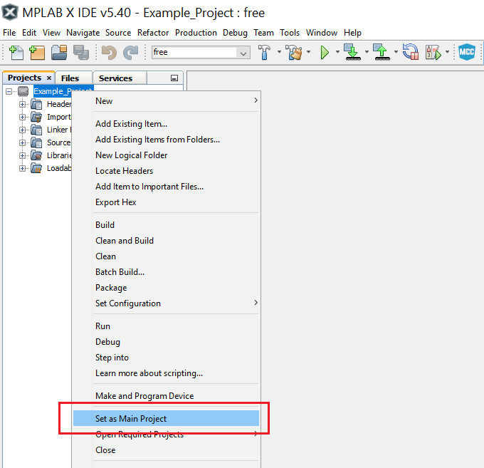
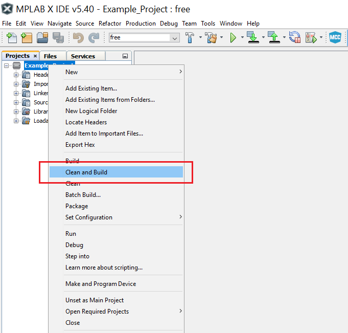
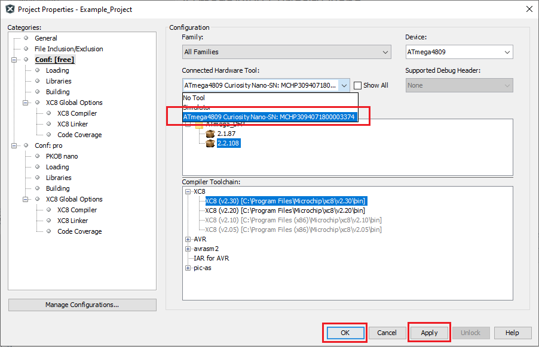
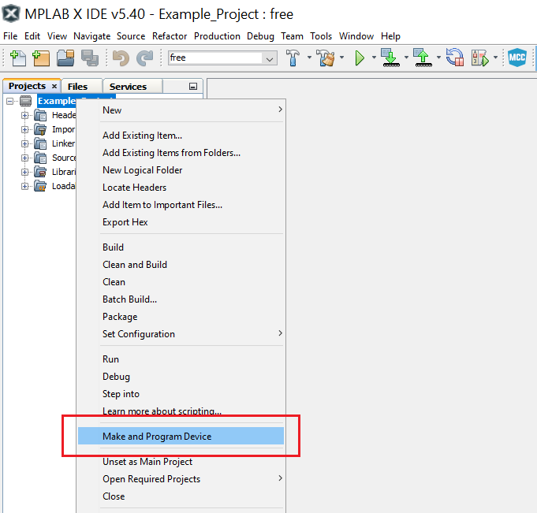

 # Blink an LED

This project shows how to blink an LED connected to a GPIO pin. The LED spends 500 ms in ON state and 500 ms in OFF state.

## Related Documentation
More details and code examples on the ATMEGA4809 can be found at the following links:
- [TB3229 - Getting Started with General Purpose Input/Output (GPIO)](https://ww1.microchip.com/downloads/en/Appnotes/Getting-Started-with-GPIO-DS90003229B.pdf)
- [ATMEGA4809 Product Page](https://www.microchip.com/wwwproducts/en/ATMEGA4809)
- [ATMEGA4809 Code Examples on GitHub](https://github.com/microchip-pic-avr-examples?q=atmega4809)
- [ATMEGA4809 Project Examples in START](https://start.atmel.com/#examples/ATmega4809XplainedPro)

## Software Used
- MPLAB® X IDE 5.40 or newer [(microchip.com/mplab/mplab-x-ide)](http://www.microchip.com/mplab/mplab-x-ide)
- MPLAB® XC8 2.30 or a newer compiler [(microchip.com/mplab/compilers)](http://www.microchip.com/mplab/compilers)
- ATmega_DFP 2.2.108 or newer Device Pack

## Hardware Used
- ATMEGA4809 Xplained Pro [(ATMEGA4809-XPRO)](https://www.microchip.com/developmenttools/ProductDetails/ATMEGA4809-XPRO)

## Setup
The ATMEGA4809 Xplained Pro Development Board is used as test platform.

 

The following configurations must be made for this project:

System clock: 3.33 Mhz

 |Pin                       | Configuration      |
 | :---------------------:  | :----------------: |
 |            PB5           |   Digital output   |

 ## Operation
 1. Connect the board to the PC.

 2. Open the Blink_an_LED.X project in MPLAB® X IDE.

 3. Set the Blink_an_LED.X project as the main project. Right click on the project in the **Projects** tab and click **Set as Main Project**.

 

 4. Clean and build the Blink_an_LED.X project: right click on the **Blink_an_LED.X** project and select **Clean and Build**.

 

 5. Select the **ATMEGA4809 Xplained Pro** in the Connected Hardware Tool section of the project settings:
   - Right click on the project and click **Properties**
   - Click on the arrow right next to Connected Hardware Tool
   - Select the ATMEGA4809 Xplained Pro (click on the **SN**), click **Apply** and then click **OK**:

 

 6. Program the project to the board: right click on the project and click **Make and Program Device**.

 

## Demo

 

The image above shows the waveform of the pin connected to the LED. The pin spends 500 ms in a high state and 500 ms in a low state.

## Summary

This project shows how to blink an LED connected to a GPIO pin of the microcontroller.
