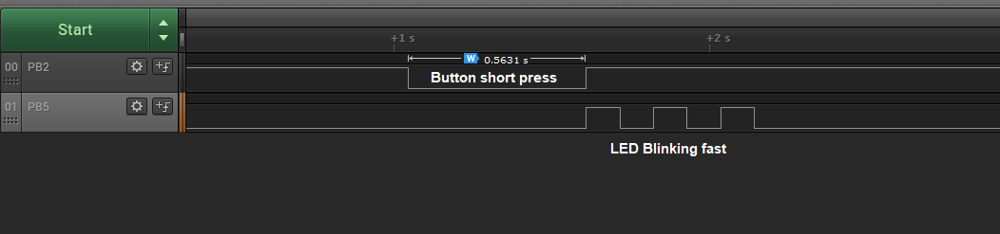

 

 # Long and Short Button Press Detection

This code example uses a GPIO pin configured as an input to distinguish between a long and a short button press, defined by a delay threshold. An LED’s blink rate is slow if a long press is detected, and fast if a short press is detected.

## Related Documentation
More details and code examples on the ATMEGA4809 can be found at the following links:
- [ATMEGA4809 Product Page](https://www.microchip.com/wwwproducts/en/ATMEGA4809)
- [ATMEGA4809 Code Examples on GitHub](https://github.com/microchip-pic-avr-examples?q=atmega4809)
- [ATMEGA4809 Project Examples in START](https://start.atmel.com/#examples/ATmega4809XplainedPro)
- [TB3229 - Getting Started with General Purpose Input/Output (GPIO)](https://ww1.microchip.com/downloads/en/Appnotes/Getting-Started-with-GPIO-DS90003229B.pdf)

## Software Used
- [MPLAB® X IDE](http://www.microchip.com/mplab/mplab-x-ide) v6.15 or newer
- [MPLAB® XC8](http://www.microchip.com/mplab/compilers) v2.45 or newer
- [ATmega_DFP](https://packs.download.microchip.com/) v3.1.264 or newer

## Hardware Used
- ATMEGA4809 Xplained Pro [(ATMEGA4809-XPRO)](https://www.microchip.com/developmenttools/ProductDetails/ATMEGA4809-XPRO)

 

## Operation

To program the ATMEGA4809 Xplained Pro board with this MPLAB® X project, follow the steps provided in the [How to Program the ATMEGA4809 Xplained Pro Board](#how-to-program-the-atmega4809-xplained-pro-board) chapter.  

## Setup

The following configurations must be made for this project:

- Clock configured for 3.33 MHz
- Pin PB2 has internal pull-up enabled

 |Pin                       | Configuration      |
 | :---------------------:  | :----------------: |
 |            PB2           |   Digital input    |
 |            PB5           |   Digital output   |

 ## Demo

 

In this first image, the short button press is followed by the LED blinking at a fast rate.

 

In the second image, the long button press is followed by the LED blinking at a slow rate.

## Summary

The GPIO interface can be used to sense external digital signals to make certain decisions. In this code example, the focus was on pushing a button. An LED’s blink rate was slow if a long press was detected, and fast if a short press was detected.

##  How to Program the ATMEGA4809 Xplained Pro board

This chapter shows how to use the MPLAB® X IDE to program an AVR® device with an `Example_Project.X`. This can be applied for any other projects. 

1. Connect the board to the PC.

2. Open the `Example_Project.X` project in MPLAB X IDE.

3. Set the `Example_Project.X` project as main project:
   Right click on the project in the **Projects** tab and click Set as Main Project.
   

4. Clean and build the `Example_Project.X` project:
   Right click on the `Example_Project.X` project and select Clean and Build.
   

5. Select the ATMEGA4809 Xplained Pro in the Connected Hardware Tool section of the project settings
   Right click on the project and click Properties.
   Click on the arrow under the Connected Hardware Tool.
   Select the ATMEGA4809 Xplained Pro by clicking on the SN.
   Click **Apply** and then **OK**.
   

6. Program the project to the board:
   Right click on the project and then Make and Program Device.
   

 

- [Back to Top](#long-and-short-button-press-detection)
- [Back to Setup](#setup)
- [Back to Demo](#demo)
- [Back to Summary](#summary)