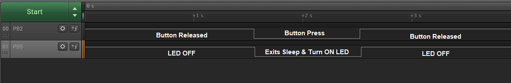
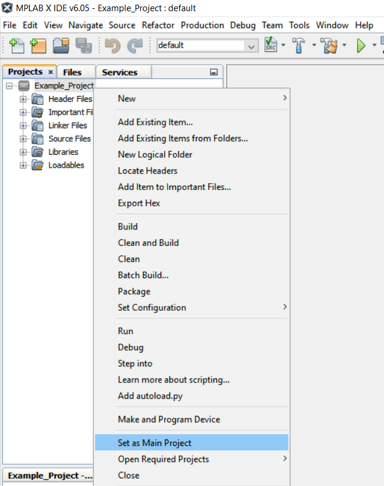
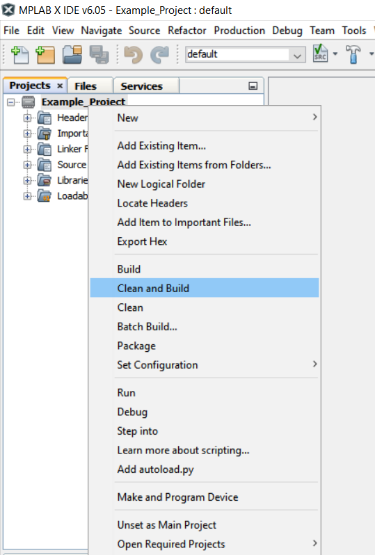
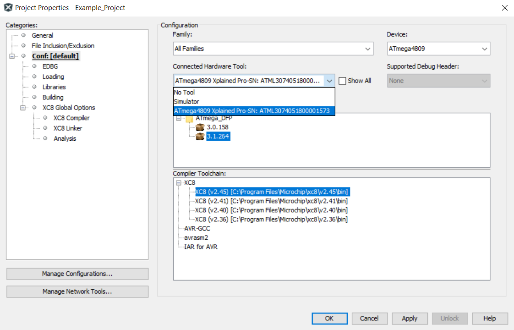
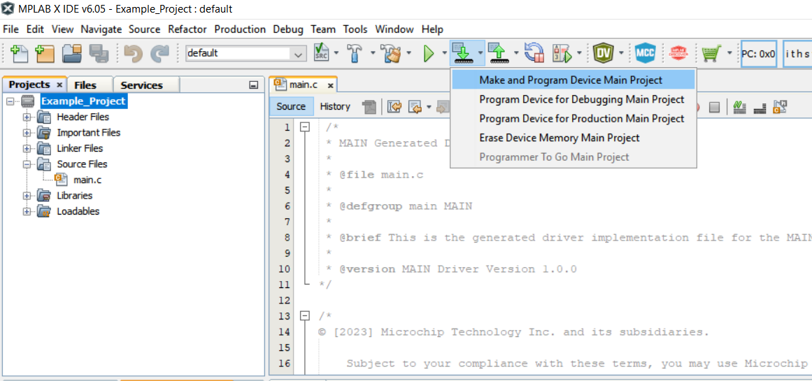

 

 # Wake Up on Button Press Using the ATmega4809 Microcontroller

This code example demonstrates how to wake up the microcontroller (MCU) from Sleep mode by pressing a button. The MCU exits Sleep mode when the button is pressed, turns on an LED and returns to Sleep mode. On button release, it exits Sleep mode, turns off the LED and goes back to Sleep mode.

## Related Documentation
More details and code examples on the ATMEGA4809 can be found at the following links:
- [ATMEGA4809 Product Page](https://www.microchip.com/wwwproducts/en/ATMEGA4809)
- [ATMEGA4809 Code Examples on GitHub](https://github.com/microchip-pic-avr-examples?q=atmega4809)
- [ATMEGA4809 Project Examples in START](https://start.atmel.com/#examples/ATmega4809XplainedPro)
- [Getting Started with General Purpose Input/Output (GPIO)](https://ww1.microchip.com/downloads/en/Appnotes/Getting-Started-with-GPIO-DS90003229B.pdf)

## Software Used
- [MPLAB® X IDE](http://www.microchip.com/mplab/mplab-x-ide) v6.15 or newer
- [MPLAB® XC8](http://www.microchip.com/mplab/compilers) v2.45 or newer
- [ATmega_DFP](https://packs.download.microchip.com/) v3.1.264 or newer

## Hardware Used
- [ATMEGA4809 XPLAINED PRO](https://www.microchip.com/developmenttools/ProductDetails/ATMEGA4809-XPRO)

 

## Operation

To program the ATMEGA4809 Xplained Pro board with this MPLAB® X project, follow the steps provided in the [How to Program the ATMEGA4809 Xplained Pro Board](#how-to-program-the-atmega4809-xplained-pro-board) chapter.  

## Setup

The following configurations must be made for this project:

- Clock configured for 3.33 MHz
- Power-Down Sleep mode set
- Global interrupts enabled
- Interrupt enabled for pin PB2, the button
- Pin PB2 configured with internal pull-up

 |Pin                       | Configuration      |
 | :---------------------:  | :----------------: |
 |            PB2           |   Digital input    |
 |            PB5           |   Digital output   |

## Demo

 

In this demo, the button is pressed, the microcontroller exits Sleep mode, and turns on the LED.

## Summary

This use case demonstrates how to wake up the microcontroller from Sleep mode by pressing a button.

##  How to Program the ATMEGA4809 Xplained Pro Board

This chapter shows how to use the MPLAB X IDE to program an AVR® device with an `Example_Project.X`. This can be applied for any other projects. 

1. Connect the board to the PC.

2. Open the `Example_Project.X` project in MPLAB X IDE.

3. Set the `Example_Project.X` project as main project:
   Right-click the project in the **Projects** tab and click Set as Main Project.
   

4. Clean and build the `Example_Project.X` project:
   Right-click the `Example_Project.X` project and select Clean and Build.
   

5. Select the ATMEGA4809 Xplained Pro in the Connected Hardware Tool section of the project settings
   Right-click the project and click **Properties**.
   Click the arrow under the Connected Hardware Tool.
   Select the ATMEGA4809 Xplained Pro by clicking on the SN.
   Click **Apply** and then **OK**.
   

6. Program the project to the board:
   Right-click the project and then Make and Program Device.
   

 

- [Back to Top](#wake-up-on-button-press-using-the-atmega4809-microcontroller)
- [Back to Setup](#setup)
- [Back to Demo](#demo)
- [Back to Summary](#summary)
